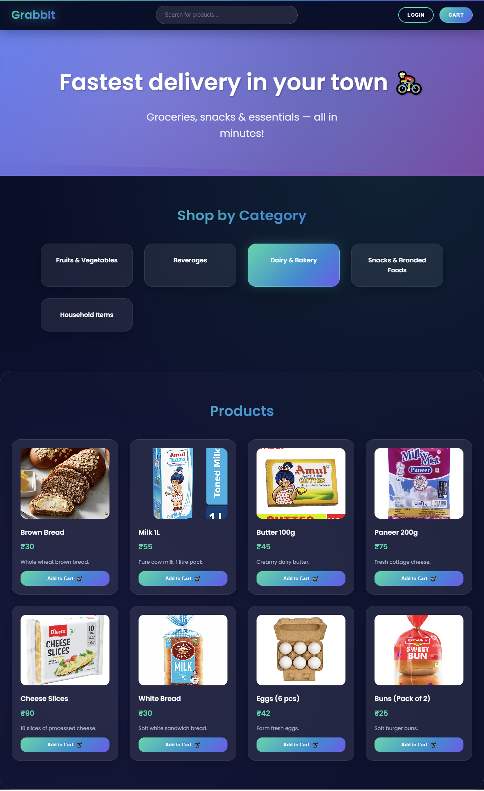
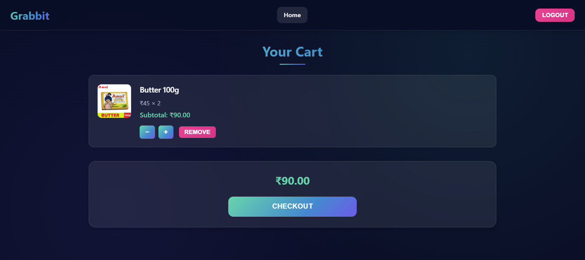
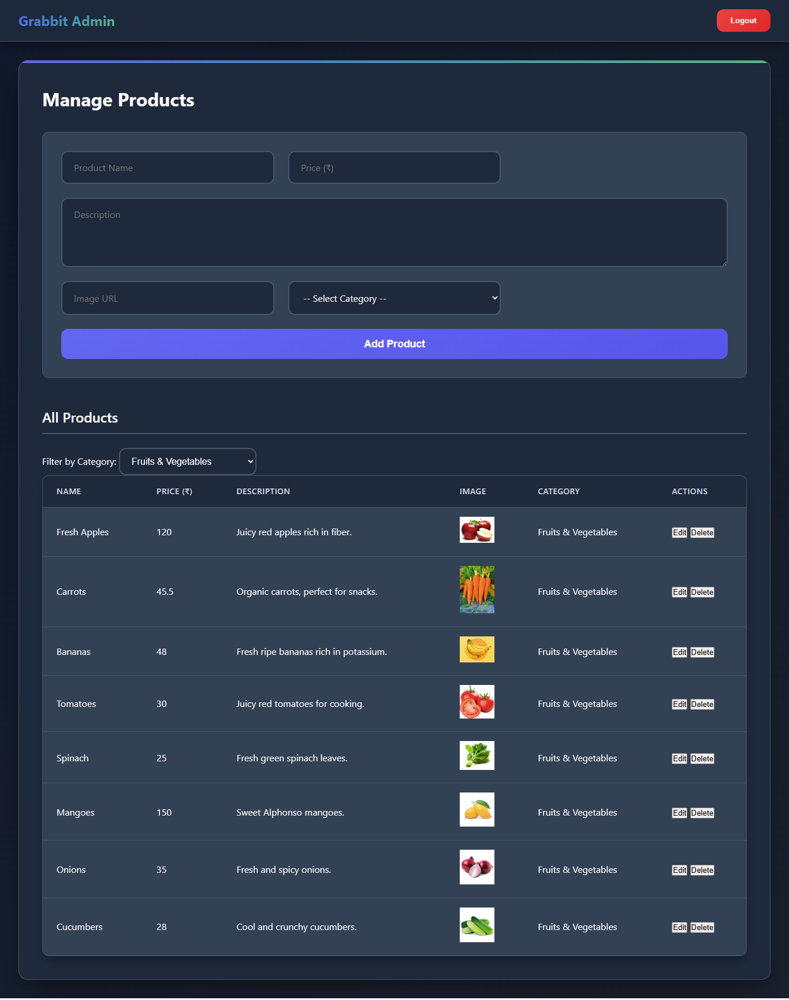

# 🛒 Grabbit – Java Web App (Blinkit Clone)

Grabbit is a mini e-commerce web application inspired by Blinkit, developed using Java Servlets, JSP, and MySQL. It allows users to browse products by category, manage a shopping cart, and provides admin capabilities for managing inventory.

> ✅ Built as a final-year diploma project by Sagar Balaji Salgar

---

## ✨ Features

### 👤 User Side
- View products category-wise
- Add items to cart
- Adjust quantity / remove items
- Session-based cart persistence
- Login/logout functionality

### 🛠️ Admin Panel
- Add, update, delete products
- View products by category

---

## 🧰 Tech Stack

| Layer        | Tech                          |
|-------------|-------------------------------|
| Frontend     | HTML, CSS, JavaScript         |
| Backend      | Java (Servlets), JSP          |
| Database     | MySQL                         |
| Build Tool   | Maven                         |
| Web Server   | Apache Tomcat (local)         |

---

## 🖥️ Folder Structure

Grabbit/
├── src/
│ ├── db/ # DB connection utility
│ ├── model/ # Java model classes (Product, User, etc.)
│ ├── service/ # Service logic (ProductService, etc.)
│ ├── ui/ # Servlet classes
│ └── util/ # Input helpers
├── public/ # Frontend files (HTML/CSS/JS)
├── lib/ # MySQL Connector JAR
├── grabbitdb.sql # Database schema and sample data
├── pom.xml # Maven config
└── README.md

---

## ⚙️ Setup Instructions

1. Clone the repo
  git clone https://github.com/yourusername/Grabbit.git
  cd Grabbit

2. Import into IntelliJ or Eclipse
  Open as Maven project.
  Add Tomcat server (Apache Tomcat 10+ recommended).

3. Setup Database
  Start MySQL server.
  Create database and import schema:
    #CREATE DATABASE grabbitdb;
    #USE grabbitdb;
    -- Then import grabbitdb.sql

4. Update DBConnection.java if needed:
    String url = "jdbc:mysql://localhost:3306/grabbitdb";
    String username = "root";
    String password = "your_mysql_password";

5. Run the Project
  Build WAR and deploy to Tomcat
  Access app at: http://localhost:8800/Grabbit

  ---
  
  ## 📸 Screenshots
#Homepage -

---

#art Page -

---

#Admin Panel -

---

#Download Screen Recording -
[Download](https://github.com/Sagar-2008/Grabbit/raw/refs/heads/master/assets/screenrec.mp4)

---

🙌 Acknowledgements
Inspired by Blinkit. Made with ☕ and lots of enthusiasm.

---

📜 License
This project is open-source and free to use for educational purposes.
